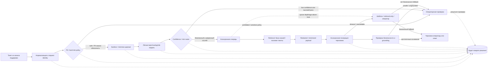

# Целевая архитектура

## Поток обработки

## FAST PATH: до 500 мс

Горячий путь должен быть синхронным, коротким и stateless на уровне экземпляра сервиса:

1. принять тикет из канала;
2. нормализовать формат и создать или проверить `request_id`;
3. применить взаимоисключающую PII/hard-risk policy: PII, которую можно безопасно обезличить/минимизировать, проходит через sanitization; запрещённые или чувствительные policy cases сразу направляются оператору;
4. применить лёгкую topic/routing/risk-модель только к безопасному или sanitized payload;
5. передать тему, маршрут, риск и уверенность в confidence/risk router.

Внешний LLM API на горячем пути запрещён. Горячий путь возвращает решение маршрутизации или состояние, что тикет направлен оператору/в асинхронную обработку; генерация ответа не блокирует классификацию.

## SLOW PATH: асинхронная обработка

Безопасные и достаточно уверенные тикеты попадают в очередь, чтобы пики не блокировали синхронное API. Далее система ищет релевантные фрагменты утверждённой базы знаний и похожие разрешённые тикеты, формирует redacted/minimized payload и только его передаёт внешнему генератору. Исходный тикет и необезличенные данные остаются внутри доверенного контура. После генерации черновик проверяется на безопасность и достаточность оснований и только затем отдаётся оператору или разрешённому каналу ответа.

В PoC очередь и аудит могут быть in-memory абстракциями. В целевой архитектуре очередь нужна для буферизации пиков, bounded backpressure и повторяемого фонового выполнения, а durable storage — для тикетов, статусов и аудита после перезапуска.

### Идемпотентность и retries

- `request_id`/`operation_id` используется как idempotency key;
- worker атомарно захватывает операцию переходом `PENDING -> PROCESSING` через conditional update, транзакцию или compare-and-set;
- только worker, успешно выполнивший claim, может выполнять внешний side effect;
- после side effect результат фиксируется переходом в `SENT`/`COMPLETED`;
- если внешний провайдер поддерживает idempotency keys, туда также передаётся тот же `operation_id` как вторая защита;
- все retries используют тот же idempotency key и не создают новую операцию.

## HITL

Тикет обязательно передаётся оператору, если:

- сработала hard-risk категория или запрещённое автоматическое действие;
- confidence/risk router признал случай неоднозначным;
- retrieval не дал достаточного основания для ответа;
- генерация получилась unsafe или ungrounded;
- внешняя зависимость недоступна и безопасный fallback не применим.

Операторское решение и причина эскалации также попадают в аудит.

## Prompt injection: layered mitigation

- текст тикета и retrieved-документы считаются **ненадёжными данными**, а не инструкциями;
- пользовательский и retrieved-текст помещается только в явно разделённые поля данных/контекста;
- system/developer policy не может быть переопределена инструкциями внутри тикета или retrieved-контента;
- retrieval использует только заранее одобренные источники;
- LLM adapter в PoC не предоставляет произвольные tools/actions;
- будущий слой tools/actions должен использовать allowlist и отдельную авторизацию вне модели;
- подозрительные или конфликтующие инструкции, а также недостаточное grounding приводят к human review.

Это layered mitigation, а не утверждение, что prompt injection полностью решён.

## Аудит

Каждое автоматическое решение создаёт аудируемое событие: `request_id`, время, канал, версии правил/модели/конфигурации, результат классификации, риск и confidence, использованные источники retrieval, статус генерации, причину эскалации и итог оператора. Сырые PII следует минимизировать и ограничивать по сроку хранения; в логах PoC достаточно безопасного mock-содержимого и идентификаторов.

## Поведение при 10-минутном отказе LLM

- классификация и маршрутизация на FAST PATH продолжаются без LLM;
- тикеты не теряются: безопасные задания остаются в очереди или durable storage, а приём ограничивается bounded backpressure;
- выполняются только bounded retries с таймаутом и backoff; повтор не должен создавать duplicate side effect;
- для известных типовых случаев используется retrieval-only или заранее проверенный шаблон;
- если безопасного fallback нет, тикет переводится оператору, а не закрывается автоматически;
- при превышении порога `queue depth` или `queue age` новые безопасные тикеты продолжают классифицироваться, но вместо LLM-пути переводятся на retrieval/template fallback либо оператору; ingestion не ждёт освобождения LLM workers;
- после исчерпания retry тикет остаётся доступным для повторной обработки или ручной проверки;
- рост ошибок LLM, очереди, времени ожидания и доли эскалаций должен вызвать технический алерт.

## Capacity sanity check

- Средняя нагрузка: `200000 / 86400 ≈ 2,3 тикета/с`.
- Пиковая нагрузка: `20000 / 600 ≈ 33,3 тикета/с`.

Эти оценки поддерживают stateless и лёгкий FAST PATH с горизонтальным масштабированием. Медленная генерация не должна занимать горячий путь: для неё нужен асинхронный буфер и контроль backpressure.

## Реализуется в PoC

- mock-ticket;
- request identity;
- детерминированная простая topic/routing/risk-классификация;
- правила hard-risk;
- retrieval по небольшой локальной базе знаний;
- черновик или маршрут обработки;
- audit log;
- happy path;
- risky или low-confidence эскалация оператору;
- простой degraded LLM-сценарий, если он нужен для демонстрации.

## Только дизайн

- production message broker и durable storage;
- production model serving;
- отдельный PII-сервис;
- production monitoring stack;
- pipeline обучения и переобучения моделей;
- операторский UI;
- полный MLOps.
