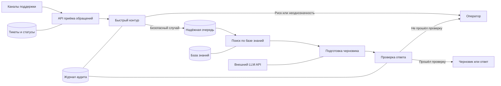
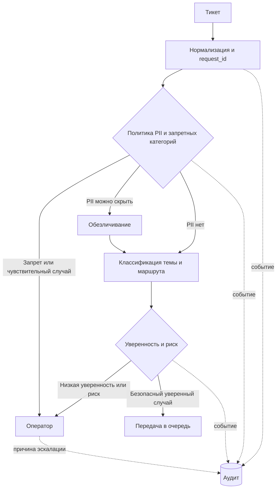
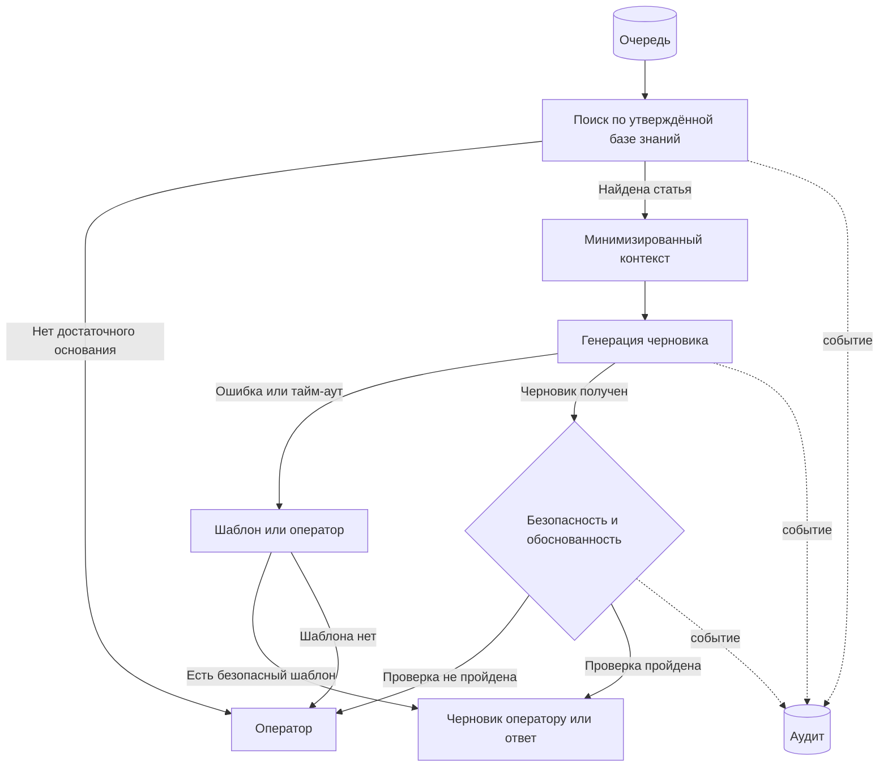

# Архитектура

## Целевая система

В PoC реализованы API и синхронный локальный конвейер. Очередь, фоновые исполнители, постоянное хранилище тикетов и внешняя LLM показаны только как целевая архитектура. Журнал PoC — JSONL-файл; в целевой системе это постоянное хранилище аудируемых событий.

## Быстрый контур: ориентир до 500 мс

Здесь нет внешней LLM. В PoC адрес электронной почты и телефон заменяются маркерами; запрещённые категории безопасности аккаунта, спорного списания и передачи кода сразу идут оператору. В реальной системе правила расширяются политикой обработки данных: данные, которые нельзя безопасно минимизировать, также не передаются дальше.

## Медленный контур и деградация

Поиск использует только утверждённые статьи и обезличенные исторические обращения с подтверждённым решением. Внешний генератор получает лишь обезличенный текст тикета и выбранную статью; исходный тикет остаётся в доверенном контуре. Текст тикета и найденных документов считается данными, а не инструкциями: он передаётся в отдельные поля и не рассматривается как указание системе, а в PoC у LLM нет произвольных инструментов или действий. Это многослойное снижение риска инъекций, а не гарантия их полного устранения. Будущий слой действий должен иметь белый список и авторизацию вне модели; конфликтующие инструкции или недостаток оснований ведут к оператору.

## Человек в контуре

Оператор получает тикет, если сработала запретная категория, классификатор не уверен, поиск не нашёл достаточного основания, черновик не прошёл проверку или внешний сервис недоступен без безопасного шаблона. В PoC фиксируются решение и причина эскалации; в целевой системе аудируется также решение оператора.

## Аудит и идемпотентность

Каждое автоматическое решение создаёт событие аудита: `request_id`, время, канал, тема, маршрут, риск, уверенность, идентификатор найденной статьи, статус генерации и причина эскалации. Исходный текст тикета и ключи не записываются. Если запись аудита в PoC не удалась, успешный автоматический результат не возвращается.

В целевой системе `request_id` или `operation_id` служит ключом идемпотентности. Исполнитель атомарно переводит операцию из `PENDING` в `PROCESSING` условным обновлением, транзакцией или compare-and-set. Внешнее действие выполняет только исполнитель, успешно захвативший операцию; затем результат сохраняется как `SENT` или `COMPLETED`. При поддержке у провайдера тот же `operation_id` передаётся и ему. Повторные попытки всегда используют тот же ключ, поэтому повторная доставка сообщения не создаёт второе действие.

## Отказ внешней LLM на 10 минут

Классификация и маршрутизация продолжаются в быстром контуре. Тикеты не теряются: безопасные задания остаются в очереди или постоянном хранилище. Исполнитель использует ограниченное число попыток с тайм-аутом и задержкой; при переполнении очереди новые безопасные тикеты всё равно классифицируются, но идут по безопасному шаблону, поиску без генерации или оператору. Приём тикетов не ждёт освобождения исполнителей LLM. После исчерпания попыток тикет остаётся доступным для повторной или ручной обработки, а рост ошибок LLM, возраста очереди и доли эскалаций вызывает предупреждение.

В PoC очередь и повторные попытки не реализованы. Ошибка локального либо опционального внешнего генератора синхронно переводит тикет в `needs_review` без черновика.

## Нагрузка

- Средняя нагрузка: `200000 / 86400 ≈ 2,3 тикета/с`.
- Пиковая нагрузка: `20000 / 600 ≈ 33,3 тикета/с`.

Эти оценки требуют лёгкого, не хранящего состояние на экземпляре быстрого контура и горизонтального масштабирования в целевой системе. Медленная генерация должна быть отделена очередью, чтобы не занимать быстрый контур во время пика.

## Границы PoC

**Реализовано:** тестовый вход, `request_id`, правила риска, скрытие email и телефона, простая классификация темы и маршрута, локальный поиск, детерминированный черновик, JSONL-аудит, FastAPI, обычный и рискованный сценарии, безопасный отказ генератора. Необязательные адаптеры Qdrant и OpenRouter выбираются локальной конфигурацией; по умолчанию используются лексический поиск и детерминированный генератор.

**Спроектировано:** производственный брокер сообщений, постоянные хранилища, обслуживание моделей, отдельная служба PII, очередь и повторные попытки, интерфейс оператора, полный контур обучения и наблюдаемости, отказоустойчивый Qdrant и семантическая оценка обоснованности ответа.
